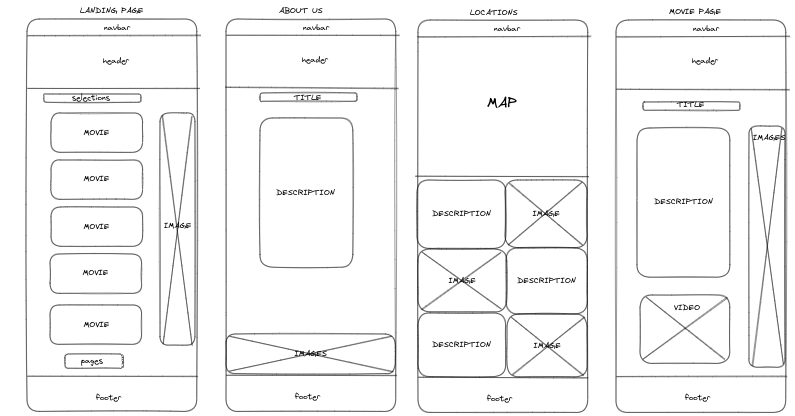

# MyCinema

## Osnovne informacije
>
>SVEUČILIŠTE U SPLITU,
>FAKULTET ELEKTROTEHNIKE, STROJARSTVA I BRODOGRADNJE
>
>**Kolegij:**
>Korisnička sučelja
>
>**Mentori:**
>Mario Čagalj, Ivan Kuliš
>
>**Studenti:**
>William Lozano Štrkalj, Ivan Legac Rudan, Luka Smoljo

## Uvod

Čovjek je po svojoj prirodi pretežito vizualno biće, te je jedna od najpopularnijih ljudskih aktivnosti gledanje filmova. Zbog toga je odlazak u kino jedna od najčešćih ljudskih opcija za uživanje u svom slobodnom vremenu. Kino dvorane su institucije koje su već stoljećima prisutne u životima generalne populacije, međutim, nisu one bez svojih mana:

- Ogromne gužve 
- Nepotpune informacije
- Rasprodanost karata
- Raspored sjedala

Neki su od problema vezani uz odlazak u kino. Zbog ovakvih okolnosti mnogi ljudi jednostavno izgublje strpljenje i odluče napustiti samu dvoranu i na drugi način ispuniti ono malo slobodnog vremena što imaju. Ulaskom u 21. stoljeće i razvojem interneta omogućeno je dizajniranje aplikacija koje su specifično dizajnirane za rješavanje navedenih problema. Iako su u većini slučaja uspjeli u ostvarenju svog cilja, na žalost dovode do pojave novih problema:

- Razbacano sučelje
- Teško za korištenje
- Ponovni nepotpun prikaz potrebnih informacija
- Bugovi i loše performance

Cilj naše web stranice bi bio razrješenje svih ovih novonastalih problema razvijanjem aplikacije koja bi korisnicima nudila jasan pregled najbitnijih informacija te jednostavnu i brzu rezervaciju karata.

### Očekivani tip korisnika

***MyCimena*** web stranica je namijenjena generalnoj populaciji te bi trebala biti dovoljno jednostavna za korištenje svim korisnicima, u bilo kojoj životnoj dobi. Ukratko, korisnik može biti bilo koja osoba koja želi sustav koji omogućuje jednostavan i bezbrižan odlazak u kino, bez gore navedenih problema.

## Zahtjevi sustava

Istraživanjem već postojećih kino sustava te pomnim analiziranjem usluga koje oni nude došli smo do zaključka da bi naša aplikacija trebala ispunjavati sljedećih 5 zahtjeva:

- Izlistati sve filmove koji se trenutno prikazuju
- Nuditi kratak, ali jasan opis za svaki filma
- Prikaz lokacija kino dvorana
- Sustav za kupnju i rezervaciju karata
- Višeplatformsko korištenje

Cilj nam je bio dizajnirati što manju i što efikasniju aplikaciju koja bi sadržavala samo osnovne značajke za optimalan *user experience*. Ove smo zahtjeve oredili na temelju najčešćih kritika korisnika već postojećih sustava te na kraju krajeva, osobnim iskustvom stečenih tijekom njihova korištenja. U tablici ispod se nalazi prikaz navedenih korisničkih zahtjeva i kratki opis uz njih. 

| Zahtjev  | Kratki opis |
| ------------- |:-------------:|
| Izlistati filmove | Na uredan i pregledan način prikazati listu svih filmova koji se taj tjedan prikazuje u kinu |
| Kratak opis filma | Nekoliko najbitnijih rečenica o *selektiranom* filmu, navesti glavne glumce i redatelje te par rečenica o radnji bez pre velikog otkrivanja radnje     |
| Prikaz lokacija| Jasna uputstva o lokaciji ustanove u kojoj se nalazi kino dvorana i broj telefona za kontakt |
| Sustav za rezervaciju i kupnju karata | Rješiti već dugotrajne probleme i nesigurnosti kupaca jednostavnim i lako razumljivim sučeljem |
| Višeplatformsko korištenje | Omogućavanje korištenja aplikacije na svim uređajima koji imaju pristup internetu tako olakšavajući dostupnost korisnicima |

## Low fidelity

Za dizajniranje prototipa ***MyCinema*** aplikacije koristili smo **Excalidraw** alat za crtanje dijagrama.

### Desktop pages

Na ovoj slici su prikazani low-fidelity modeli vezani uz **Landing, About us, Locations** i **Movie** stranica. Imena ovih stranica dovoljno deskriptivno opisuju koji od gore navedenih zahtjeva ispunjavaju.

### Mobile pages

Na ovoj slici su prikazani low-fidelity modeli vezani uz mobilne verzije **Landing, Movie** i **About us** stranica.

